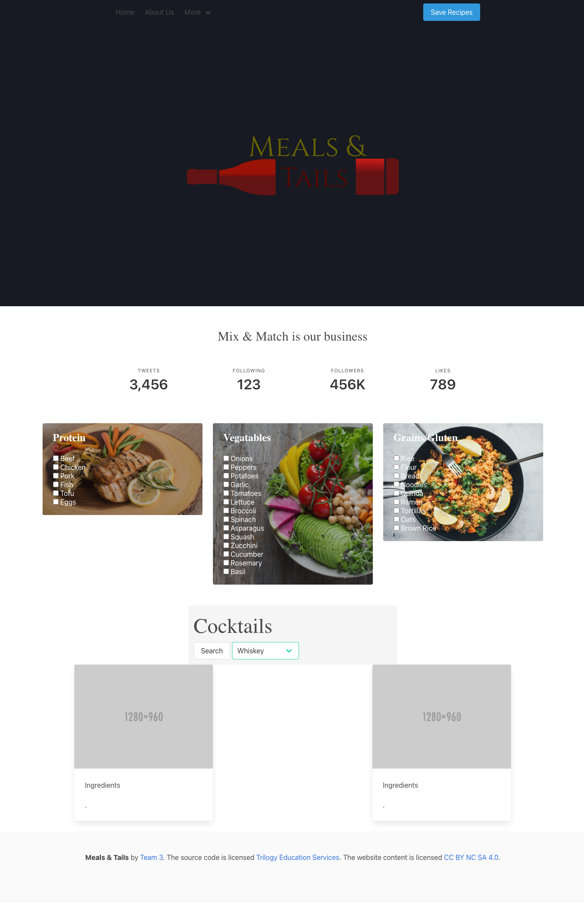

# Project1

[Github Repo](https://github.com/mcolumbusua21/Project1)

[Web Aplication](https://mcolumbusua21.github.io/Project1/)

# User Story
As I try and come up with something to eat, my mind goes blank. So I come to Meals and Tails, choose a protein, veggie and/or grain. I can then also choose a beverage to pair with my meal. A recipe will pop up with a refreshing paired beverage.

# Wireframe

# Flow Chart
User selects protein -> veggies -> grain -> diet  
Choose beverage type  
Click submit  
Takes us to recipes and beverage  
User has option to save recipes  

